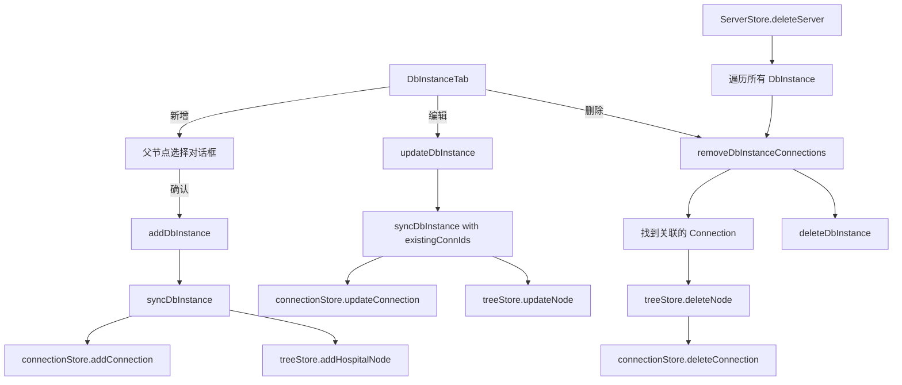

## 产品概述

将服务器资源管理中的数据库实例（DbInstance）与编辑器的连接管理、左侧菜单树进行单向实时同步。当在服务器资源管理中新增、删除或修改数据库信息时，自动同步到编辑器的连接管理和左侧菜单树。

## 核心功能

- **单向同步**：服务器资源 → 连接管理 + 左侧菜单树
- **父节点选择**：新增 DbInstance 时弹窗让用户选择树节点父节点（Platform/PreDbType/District）
- **自动字段映射**：从 DbInstance + ServerHost 自动提取 host(internalIp)/port/username/password/database(dbName) 映射到 DbConnection
- **实时同步**：增删改 DbInstance 时立即触发同步
- **多凭据支持**：一个 DbInstance 有多个 credentials 时，每个凭据对应创建一个 DbConnection + TreeNode（Hospital 类型）

## 技术栈

- 前端框架：React + TypeScript + Zustand（状态管理）
- UI 组件库：MUI (Material-UI)
- 数据流：serverStore → connectionStore + treeStore

## 实现方案

### 一、数据类型扩展

#### 1.1 扩展 DbConnection 类型

**文件**: `deliverables/software-company/db-unify/src/types/connection.ts`

当前 `DbConnection` 已有 `serverId?: string` 字段，需新增两个字段以建立与 DbInstance 的关联：

- `dbInstanceId?: string` — 关联的数据库实例 ID
- `credentialIndex?: number` — 凭据索引（区分同一实例的多个凭据）

#### 1.2 扩展 ConnectionParams

**文件**: `deliverables/software-company/db-unify/src/services/connectionApiService.ts`

在 `ConnectionParams` 接口中增加 `serverId`、`dbInstanceId`、`credentialIndex` 字段，并更新 `createConnection` / `updateConnection` 函数传递这些字段到后端。

#### 1.3 dbType → DbDriver 映射

在同步服务中实现映射函数：

- MySQL / 未知 → `DbDriver.MySQL`
- PostgreSQL / 瀚高 → `DbDriver.PostgreSQL`
- Oracle → `DbDriver.Oracle`
- SQL Server → `DbDriver.SQLServer`
- 其他 → `DbDriver.Custom`

### 二、新建父节点选择对话框组件

**新文件**: `deliverables/software-company/db-unify/src/components/server-resource/ParentNodeSelector.tsx`

**功能**：

- 以树形结构展示 Platform → PreDbType → District 三层层级
- 只展示到 District 层级，不展示 Hospital 节点
- 只允许选择 District 类型的节点
- 提供"取消"和"确认"按钮，未选中时"确认"置灰

**实现要点**：

- 复用 `useTreeStore` 获取 `nodes` 和 `rootNodeIds`
- 递归渲染节点，通过 `node.type` 控制可选状态
- 选中后回调 `onSelect(parentNodeId: string)`

### 三、新建同步服务

**新文件**: `deliverables/software-company/db-unify/src/services/dbInstanceSyncService.ts`

#### 核心函数

1. **syncDbInstance** — 将 DbInstance 同步到连接管理和树节点

- 参数：`serverHost`, `dbInstance`, `parentNodeId`, `existingConnIds?`
- 逻辑：遍历每个 credential，创建/更新 DbConnection，再创建/更新对应的 Hospital 树节点

2. **removeDbInstanceConnections** — 删除 DbInstance 关联的连接和树节点

- 参数：`serverId`, `dbInstanceId`
- 逻辑：查找关联的连接 → 找到对应的 Hospital 节点 → 删除树节点 → 删除连接

#### 字段映射规则

| DbConnection 字段 | 数据来源 |
| --- | --- |
| `name` | `credential.connectionName` 或 `${dbInstance.dbName}_${credential.username}` |
| `driver` | `dbInstance.dbType` 通过映射函数转换 |
| `host` | `serverHost.internalIp` |
| `port` | `dbInstance.port` |
| `username` | `credential.username` |
| `password` | `credential.password`（值为 `******` 时跳过） |
| `database` | `dbInstance.dbName` |
| `schema` | `credential.schema` |
| `serverId` | `serverHost.id` |
| `dbInstanceId` | `dbInstance.id` |
| `credentialIndex` | 凭据在数组中的索引 |


### 四、修改 DbInstanceTab 组件

**文件**: `deliverables/software-company/db-unify/src/components/server-resource/DbInstanceTab.tsx`

#### 4.1 新增状态

- `parentSelectorOpen` — 控制父节点选择对话框
- `pendingSaveData` — 暂存表单数据（新增时先选父节点再保存）

#### 4.2 修改新增流程

当前：填写表单 → 点击保存 → 直接调用 `addDbInstance` → 关闭弹窗

修改为：

1. 表单验证通过后，将表单数据暂存到 `pendingSaveData`
2. 打开父节点选择对话框
3. 用户确认选择后，回调中执行：

- `await addDbInstance(serverId, pendingSaveData)` 创建 DbInstance
- 从 `serverStore` 获取最新实例数据
- 调用 `syncDbInstance(serverHost, newInstance, selectedParentId)` 同步

4. 关闭所有对话框，刷新列表

#### 4.3 修改编辑流程

在 `await updateDbInstance(...)` 成功后：

1. 通过 `serverId + dbInstanceId` 查找已关联的连接 ID 列表
2. 调用 `syncDbInstance(..., existingConnIds)` 更新连接和树节点

#### 4.4 修改删除流程

在 `deleteDbInstance(...)` 之前：

1. 调用 `removeDbInstanceConnections(serverId, item.id)` 清理关联数据
2. 再执行原有删除逻辑

### 五、修改 serverStore

**文件**: `deliverables/software-company/db-unify/src/stores/serverStore.ts`

`deleteServer` 函数：删除服务器时，同步清理其下所有 DbInstance 关联的连接和树节点（遍历 `dbInstances[serverId]`，逐个调用 `removeDbInstanceConnections`）。

### 六、后端 API 扩展（如需持久化关联）

**文件**: `deliverables/software-company/db-unify/server/routes/connections.mjs`

1. `POST /api/connections` 接受 `serverId`, `dbInstanceId`, `credentialIndex` 字段
2. `PUT /api/connections/:id` 接受上述字段
3. `GET /api/connections` 响应中包含上述字段

**临时方案**（若后端暂不支持）：在连接名称中编码关联信息：`[dbInstanceId]|[credentialIndex] ${name}`，通过名称模式匹配查找关联连接。

## 架构设计

### 数据流图



### 模块依赖关系

```
dbInstanceSyncService.ts
    ├── 依赖 connectionStore (addConnection, updateConnection, deleteConnection)
    ├── 依赖 treeStore (addHospitalNode, updateNode, deleteNode)
    └── 依赖 connectionApiService (字段扩展后传递关联信息)

ParentNodeSelector.tsx
    └── 依赖 treeStore (nodes, rootNodeIds)

DbInstanceTab.tsx
    ├── 依赖 dbInstanceSyncService
    └── 依赖 ParentNodeSelector

serverStore.ts (deleteServer)
    └── 依赖 dbInstanceSyncService
```

## 目录结构

```
deliverables/software-company/db-unify/src/
├── types/
│   └── connection.ts              [修改] 增加 dbInstanceId、credentialIndex
├── services/
│   ├── connectionApiService.ts   [修改] ConnectionParams 增加新字段
│   └── dbInstanceSyncService.ts  [新建] 同步服务
├── stores/
│   ├── serverStore.ts            [修改] deleteServer 清理关联连接
│   ├── connectionStore.ts        [确认] 无需修改
│   └── treeStore.ts              [确认] 无需修改
└── components/
    └── server-resource/
        ├── DbInstanceTab.tsx     [修改] 增删改时触发同步
        └── ParentNodeSelector.tsx [新建] 父节点选择对话框
```

## 设计风格

采用与现有系统一致的 MUI 风格，保持界面统一性。父节点选择对话框采用树形选择交互，清晰展示 Platform → PreDbType → District 三层层级结构。

## 页面设计

### 父节点选择对话框（ParentNodeSelector）

**触发时机**：在 DbInstanceTab 中新增数据库实例，点击"保存"按钮后弹出。

**弹窗布局**（从上到下）：

1. **标题栏**：显示"选择父节点"，右侧关闭按钮
2. **提示文字**：说明需要选择一个区域节点（District）作为父节点
3. **树形选择区域**：

- 展示现有树结构（只读展开/折叠，可选择）
- 节点图标：Platform 用文件夹图标，PreDbType 用分类图标，District 用LocationOn 图标
- District 节点可点击选中，选中后高亮显示
- Platform 和 PreDbType 节点不可选中（置灰或点击无反应）

4. **已选显示**：在树下方显示当前选中的节点路径，如"项目A > 业务模块B > 区域C"
5. **操作按钮**：取消（关闭弹窗不保存）、确认（置灰直到选中有效节点）

**交互细节**：

- 初次打开时自动展开到 District 层级
- 选中 District 节点后，路径实时更新
- 未选中时"确认"按钮禁用
- 取消后回到新增表单，不丢失已填写内容

## Agent Extensions

### SubAgent

- **code-explorer**
- Purpose: 在规划阶段探索代码结构，确认 DbInstance、DbConnection、TreeNode 的数据关系和 API 接口
- Expected outcome: 已获取完整的类型定义、Store 方法、API 服务函数列表，为实施提供准确依据