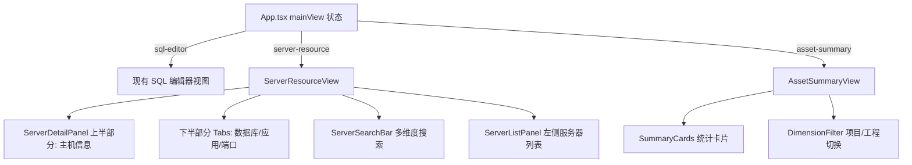

## 产品概述

在 DClaw（数据钳）中新增「服务器资源管理」功能模块。以**项目→工程→应用→服务器**四级层级串联，上半部分显示选中服务器的主机详情，下半部分通过 Tab 切换数据库实例、应用实例、端口信息。工程和应用作为独立字典维护。支持模板导入导出、多维度组合搜索、密码二次验证查看、随机密码生成、密码修改历史追溯、资产汇总分析。

## 核心功能

### 层级与字典管理

- **四级层级**：项目（Project）→ 工程（Engineering）→ 应用（Application）→ 服务器（Server）
- **字典独立维护**：工程字典和应用字典各有独立的 CRUD 页面（Dialog），新增/修改服务器时通过下拉选择关联的工程和应用
- **层级联动**：先在字典中维护工程和应用列表，服务器表单通过级联下拉选择所属层级

### 服务器资源管理

- **上下分栏布局**：上半部分展示主机基本信息（IP/操作系统/硬件规格/堡垒机/凭据/备注），下半部分通过 Tab 切换展示数据库实例列表、应用实例列表、端口信息列表
- **子资源内联管理**：在选中服务器详情面板内，直接新增/编辑/删除该服务器下的数据库实例、应用实例、端口记录
- **模板导入**：系统提供统一模板下载，用户按模板填写后导入，自动合并入库
- **多维度搜索**：支持按名称、IP、操作系统、所属工程、标签等组合条件实时过滤服务器列表
- **CRUD**：服务器及其子资源的完整增删改查

### 密码安全

- **AES-256 加密存储**：所有密码字段复用 `server/crypto.mjs` 的 encryptPassword/decryptPassword
- **二次验证查看**：点击显示明文密码时弹出对话框，需输入当前登录用户密码验证通过后才展示
- **二次验证密码配置**：系统设置中可配置/修改二次验证密码（独立于登录密码）
- **随机密码生成**：内置密码生成器，可配置长度、是否包含大小写字母、数字、特殊字符，一键生成并填入密码字段
- **密码修改历史**：每次修改密码自动记录（服务器名、字段名、修改时间、操作人），支持追溯查看

### 资产汇总分析

- **汇总仪表板**：独立视图页面，按项目、工程两个维度切换
- **统计卡片**：服务器总数、数据库实例总数、应用总数、按操作系统分布、按资源规格分布
- **列表下钻**：支持从汇总数据点击跳转到对应服务器详情

### 与现有系统的联动

- DbConnection 新增可选 `serverId` 字段，关联到服务器记录
- 服务器详情面板展示已关联的数据库连接列表

## 技术栈

- 前端：React 18 + TypeScript + MUI v5 + Tailwind CSS + Zustand 4
- 后端：Express 4 + JSON 文件持久化（database.mjs）
- 加密：复用 `server/crypto.mjs` AES-256-GCM
- Excel：前端 `xlsx` 包（项目已依赖）解析模板文件
- 认证：复用现有 JWT 中间件（`auth.mjs`），`req.user` 含 username/role

## 实现方案

### 整体架构

遵循 DClaw 现有分层模式：**types → store → services → components（前端） + routes → database.mjs（后端）**。

App.tsx 中新增两个视图状态：

- `'server-resource'` — 服务器资源管理全屏视图
- `'asset-summary'` — 资产汇总分析全屏视图

通过 AppHeader 新增按钮切换，主内容区条件渲染对应视图组件。



### 数据模型

```typescript
// 项目（顶层）
interface Project {
  id: string; name: string; sortOrder: number;
  createdAt: string; updatedAt: string;
}

// 工程字典（独立维护，属于某个项目）
interface Engineering {
  id: string; projectId: string; name: string; sortOrder: number;
  createdAt: string; updatedAt: string;
}

// 应用字典（独立维护，属于某个工程）
interface Application {
  id: string; engineeringId: string; name: string; sortOrder: number;
  createdAt: string; updatedAt: string;
}

// 服务器主机（核心实体，属于某个应用）
interface ServerHost {
  id: string; applicationId: string;
  name: string; internalIp: string; externalIp?: string; publicIp?: string;
  os?: string; cpuCores?: number; memoryGB?: number;
  systemDiskGB?: number; dataDiskGB?: number; storageType?: string;
  serverLocation?: string; serverType?: string;
  // 凭据（AES-256 加密存储）
  username?: string; password?: string;
  bastionHost?: string; bastionPort?: number;
  bastionUsername?: string; bastionPassword?: string;
  vpnInfo?: string; macAddress?: string;
  tags?: string[]; notes?: string;
  linkedConnectionIds: string[]; // 关联的 DbConnection
  createdAt: string; updatedAt: string;
}

// 数据库实例（服务器子资源）
interface DbInstance {
  id: string; serverId: string;
  dbType: string; version?: string; dbName: string; schema?: string;
  username: string; password: string; port: number;
  notes?: string;
}

// 应用实例（服务器子资源）
interface AppInstance {
  id: string; serverId: string;
  name: string; url: string; username?: string; password?: string;
  notes?: string;
}

// 端口信息（服务器子资源）
interface PortInfo {
  id: string; serverId: string;
  port: number; protocol: string; serviceName: string; notes?: string;
}

// 密码修改历史
interface PasswordHistory {
  id: string; serverId: string; fieldName: string;
  changedAt: string; changedBy: string;
}

// 二次验证配置
interface SystemConfig {
  secondaryPasswordHash: string; // bcrypt hash
}
```

### 后端 API 设计

```
# 项目
GET    /api/projects              — 列表
POST   /api/projects              — 创建
PUT    /api/projects/:id          — 更新
DELETE /api/projects/:id          — 删除

# 工程字典
GET    /api/engineerings           — 列表（可选 ?projectId= 过滤）
POST   /api/engineerings           — 创建
PUT    /api/engineerings/:id       — 更新
DELETE /api/engineerings/:id       — 删除

# 应用字典
GET    /api/applications           — 列表（可选 ?engineeringId= 过滤）
POST   /api/applications           — 创建
PUT    /api/applications/:id       — 更新
DELETE /api/applications/:id       — 删除

# 服务器
GET    /api/servers                — 列表（密码脱敏）
GET    /api/servers/:id            — 详情（含子资源，密码脱敏）
POST   /api/servers                — 创建（密码加密）
PUT    /api/servers/:id            — 更新
DELETE /api/servers/:id            — 删除（级联删除子资源）
POST   /api/servers/:id/decrypt    — 密码解密（需二次验证）
POST   /api/servers/import         — 模板批量导入

# 服务器子资源
POST   /api/servers/:id/db-instances      — 新增数据库实例
PUT    /api/servers/:id/db-instances/:di   — 更新
DELETE /api/servers/:id/db-instances/:di   — 删除
POST   /api/servers/:id/app-instances      — 新增应用实例
PUT    /api/servers/:id/app-instances/:ai   — 更新
DELETE /api/servers/:id/app-instances/:ai   — 删除
POST   /api/servers/:id/ports              — 新增端口
PUT    /api/servers/:id/ports/:pi          — 更新
DELETE /api/servers/:id/ports/:pi          — 删除

# 密码历史
GET    /api/servers/:id/password-history   — 查询密码修改记录

# 模板下载
GET    /api/servers/template/download       — 下载导入模板 xlsx

# 系统配置（二次验证密码）
GET    /api/system/config                   — 获取配置（脱敏）
PUT    /api/system/config/secondary-password — 设置/修改二次验证密码
POST   /api/system/verify-secondary-password — 验证二次验证密码

# 资产汇总
GET    /api/servers/summary                  — 汇总统计数据
```

### 实现要点

**密码二次验证流程**：

1. 前端点击"显示密码"→ 弹出 VerifyPasswordDialog → 用户输入当前登录密码
2. 前端调用 `POST /api/auth/verify-password`（body: { password }），后端用 bcrypt.compare 校验
3. 验证通过后调用 `POST /api/servers/:id/decrypt` 获取明文，展示 30 秒后自动掩码

**密码历史记录**：

- 在 `server/routes/servers.mjs` 的 PUT 处理中，检测 password 字段变更时自动 `insert('passwordHistory', { id, serverId, fieldName, changedAt, changedBy: req.user.username })`

**随机密码生成**：

- 纯前端实现，工具函数 `generatePassword({ length, uppercase, lowercase, numbers, symbols })`，放在 `src/utils/passwordUtils.ts`

**模板导入**：

- 模板格式：xlsx 文件，固定列（服务器名称、内网IP、外网IP、操作系统、CPU、内存、磁盘、所属项目、所属工程、所属应用 等）
- 模板下载接口 `GET /api/servers/template/download` 返回预置 xlsx 文件
- 导入时前端用 xlsx 包解析 → 结构化 JSON → 调用 `POST /api/servers/import`

**资产汇总**：

- 前端从 store 获取所有 servers 数据，在 AssetSummaryView 中计算统计
- 切换项目/工程维度时过滤数据重新计算

### 性能考量

- 服务器列表预期规模在 877+ 条左右，前端列表用 MUI Table 分页（每页 50 条），搜索用前端内存过滤无需后端分页
- 资产汇总在前端内存中计算，无需额外 API 调用
- JSON 文件存储的读写操作通过 database.mjs 的 enqueueWrite 队列串行化，无并发问题

### 目录结构

```
src/
├── types/
│   └── server.ts                          # [NEW] 所有服务器相关类型定义
├── stores/
│   ├── serverStore.ts                     # [NEW] 服务器 + 子资源 Zustand Store
│   ├── projectStore.ts                    # [NEW] 项目/工程/应用字典 Store
│   └── systemConfigStore.ts               # [NEW] 系统配置 Store（二次验证密码）
├── services/
│   └── serverService.ts                   # [NEW] 服务器 API 调用
├── components/
│   └── server-resource/
│       ├── ServerResourceView.tsx          # [NEW] 全屏主视图容器
│       ├── ServerSearchBar.tsx             # [NEW] 多维度搜索栏
│       ├── ServerListPanel.tsx             # [NEW] 左侧服务器列表
│       ├── ServerDetailPanel.tsx           # [NEW] 上半部分主机信息
│       ├── ServerDetailTabs.tsx            # [NEW] 下半部分 Tab 容器
│       ├── ServerFormDialog.tsx            # [NEW] 新建/编辑服务器对话框
│       ├── DbInstanceTab.tsx              # [NEW] 数据库实例 Tab
│       ├── AppInstanceTab.tsx             # [NEW] 应用实例 Tab
│       ├── PortInfoTab.tsx                # [NEW] 端口信息 Tab
│       ├── ServerImportDialog.tsx          # [NEW] 模板导入对话框
│       ├── PasswordGenerator.tsx           # [NEW] 随机密码生成器组件
│       ├── PasswordHistoryDialog.tsx       # [NEW] 密码历史查看对话框
│       ├── VerifyPasswordDialog.tsx        # [NEW] 二次验证对话框
│       ├── AssetSummaryView.tsx            # [NEW] 资产汇总分析视图
│       ├── EngineeringDictDialog.tsx       # [NEW] 工程字典管理对话框
│       ├── ApplicationDictDialog.tsx       # [NEW] 应用字典管理对话框
│       └── SystemConfigDialog.tsx          # [NEW] 系统设置对话框
├── utils/
│   └── passwordUtils.ts                   # [NEW] 随机密码生成工具函数
├── App.tsx                                # [MODIFY] 新增 mainView 状态
└── components/layout/
    └── AppHeader.tsx                       # [MODIFY] 新增切换按钮

server/
├── database.mjs                           # [MODIFY] DATA_FILES 新增集合
├── index.mjs                              # [MODIFY] 挂载新路由
└── routes/
    ├── servers.mjs                        # [NEW] 服务器 CRUD + 子资源 + 密码历史 + 解密
    ├── projects.mjs                       # [NEW] 项目 CRUD
    ├── engineerings.mjs                   # [NEW] 工程字典 CRUD
    ├── applications.mjs                   # [NEW] 应用字典 CRUD
    └── systemConfig.mjs                   # [NEW] 系统配置 + 二次密码验证
```

## Agent Extensions

### Skill

- **xlsx**
- 用途：生成服务器资源导入模板 xlsx 文件（含列标题和示例行），供用户下载后填写导入
- 预期结果：产出格式规范的模板文件，作为 `GET /api/servers/template/download` 的返回内容